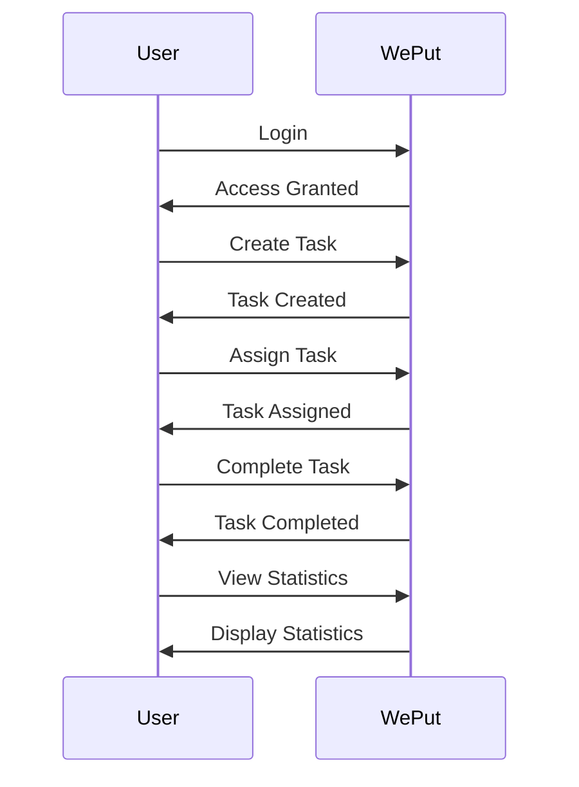

# WePut - Empowering Productivity in the Gig Economy

## Table of Contents
1. [Project Overview](#project-overview)
2. [Motivation](#motivation)
3. [Design and Development](#design-and-development)
4. [Target Audience](#target-audience)

## Project Overview
WePut is a student-driven initiative that aims to simplify task management for businesses in the gig economy. Our core objective is to enhance productivity and efficiency by providing a seamless solution to manage flexible workforces.

## Motivation
### Challenges in the Gig Economy
The fluidity and diversity of the gig economy pose numerous challenges in efficiently managing tasks. Businesses often find it difficult to maintain a cohesive workflow and ensure tasks are completed efficiently, especially when dealing with casual and contract workers.

### Solution Approach
WePut meets these challenges with an innovative approach. We focus on the fundamentals of task allocation and tracking, streamlining the workflow for businesses employing a diverse workforce. Our intuitive design and advanced features ensure seamless task management.

## Design and Development
### User-Centric Design
We pride ourselves on our user-centric design approach, where simplicity meets sophistication. Our design is meticulously tailored for intuitive navigation, promoting active user engagement and fostering a sense of ease and satisfaction in task management activities.

### Sequence Diagram
Our sequence diagram shows the flow of actions within the WePut App, starting from Login, moving through Task Creation, Assignment, Completion, and finally Viewing Statistics.

### Main Functionalities Diagram
Our main functionalities include:
- Task Management: Users can create, assign, and complete tasks.
- User Interface: Intuitive interface for seamless user interaction.
- Voice AI Interaction: Voice commands enable hands-free task management.
- Data Analytics: Machine learning models provide data-driven insights and recommendations.

## Target Audience
WePut caters to businesses of diverse scales and sizes. From budding startups to well-established enterprises, WePut offers adaptable solutions that accommodate the unique needs of each business category. Whether it's a small startup looking for efficient task management or an established enterprise seeking to optimize its workforce, WePut provides the necessary tools and adaptability to enhance productivity across the board.
